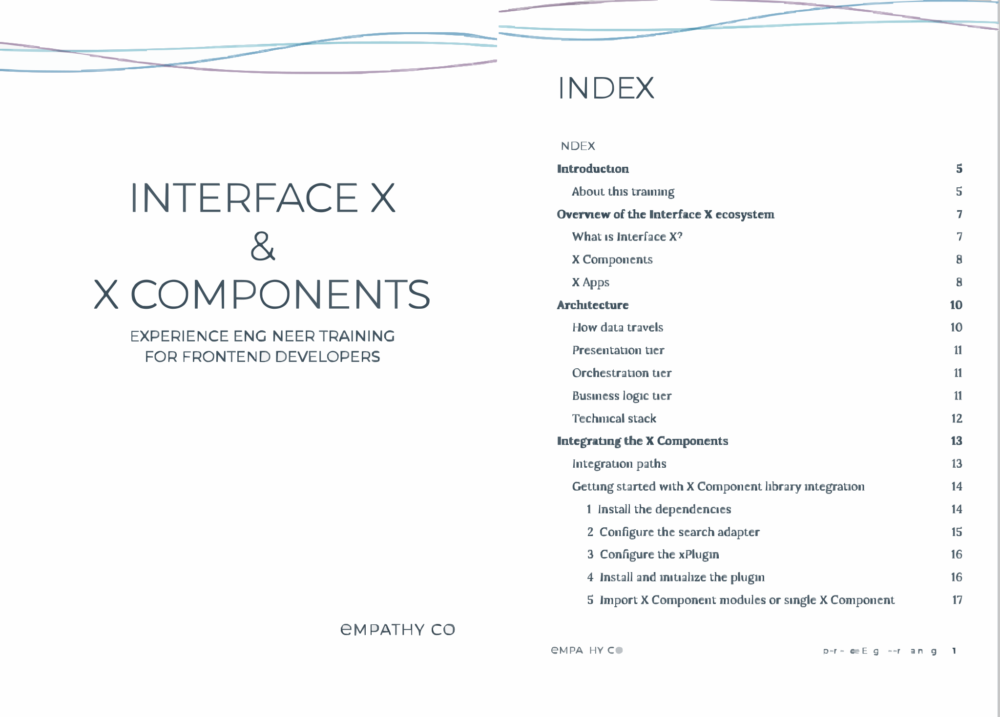

[Doc Sites](#doc-sites) · [How-to Guides](#how-to-guides) · [Integration Guides](#integration-guides) · [Configuration Guides](#configuration-guides) · [API & UI Reference](#api--ui-reference) · [Functional Overviews](#functional-overviews) · [Release Notes](#release-notes) · [Blog Posts](#blog-posts) · [Internal Materials](#internal-materials)

---

# Doc Sites

- <a href="https://docs.empathy.co">Empathy Platform Docs</a> — Centralized, docs-as-code documentation portal covering conceptual, how-to, integration, and reference content for multiple user profiles.
- <a href="https://docs.motive.co/">Motive Docs</a> — Web-based documentation portal migrated from Confluence, restructured for non-technical SME customers.
- **Apisearch Docs** — Internal documentation built from scratch after product acquisition. Excerpts available upon request.

---

# How-to Guides

- <a href="https://docs.empathy.co/play-with-empathy-platform/fine-tune-search-and-discovery/configure-next-queries.html">Configure Next Queries</a> — Empathy Platform
- <a href="https://docs.empathy.co/play-with-empathy-platform/configure-empathy-platform/configure-search-service/search-relevancy-tuning.html">Relevancy Tuning Features</a> — Empathy Platform
- **Apisearch Configuration Guides** — Available upon request

---

# Integration Guides

- <a href="https://docs.empathy.co/develop-empathy-platform/build-search-ui/web-archetype-integration-guide.html">Integrate Interface X Archetype into an Existing Website</a> — Empathy Platform
- <a href="https://github.com/empathyco/x">Interface X Components</a> — Open-source collab
- <a href="https://github.com/empathyco/empathy-self-managed-components">Self-Managed Components</a> — Open-source collab
- **Apisearch Integration Quick Guides** — Available upon request

---

# Configuration Guides

- <a href="https://docs.empathy.co/play-with-empathy-platform/configure-empathy-platform/configure-search-service/search-relevancy-tuning.html">Relevancy Tuning Features</a> — Empathy Platform
- **Apisearch Configuration Guides** — Available upon request

---

# API & UI Reference

- <a href="https://docs.empathy.co/develop-empathy-platform/api-reference/">API Reference</a> — Empathy Platform
- <a href="https://docs.empathy.co/develop-empathy-platform/ui-reference/">UI Reference</a> — Empathy Platform

---

# Functional Overviews

- <a href="https://docs.empathy.co/understand-empathy-platform/search-features/related-tags-overview.html">Related Tags Overview</a> — Empathy Platform
- <a href="https://docs.empathy.co/understand-empathy-platform/">Understand Empathy Platform</a> — Empathy Platform

---

# Release Notes

- <a href="https://docs.empathy.co/whats-new.html#release-notes-2025">Release Notes 2025</a> — Empathy Platform
- <a href="https://docs.empathy.co/release-notes-2024.html">Seasonal Release Notes</a> — Empathy Platform
- <a href="https://docs.empathy.co/doc-updates.html">Doc Releases</a> — Empathy Platform

---

# Blog Posts

- <a href="https://docs.empathy.co/blog/interface-x-integration-paths.html">Integrating Interface X Your Way</a>
- <a href="https://medium.com/empathyco/redefining-technical-documentation-at-empathy-co-a-three-year-journey-of-disruption-6457b617c386">Redefining Technical Documentation at Empathy.co: A Three-Year Journey of Disruption</a>
- <a href="https://docs.empathy.co/blog/fine-tune-mistral-for-dev-portal-overview.html">Fine-tuning Mistral for an Enhanced Content Search Experience (Parts I–IV)</a>
- <a href="https://docs.empathy.co/blog/revolutionize-search-analytics-with-backroom.html">Revolutionize Your Commerce Search Analytics with Empathy's Backroom</a>

---

# Internal Materials

Non-public materials available as censored excerpts upon request.

- **Style Guides & Writing Standards**
- **Product & Domain Glossaries**
- **Technical Writer Onboarding Guides**
- **Partner & Stakeholder Training Materials**
- **Documentation Processes & Workflows**

<table>
  <tr>
    <td align="center">
       
      Glossaries & Dictionaries
    </td>
    <td align="center">
       
      Style Guides
    </td>
    <td align="center">
       
      Onboarding and Training Guides for Technical Writers
    </td>
    <td align="center">
       
      Learning Paths & Certifications
    </td>
  </tr>
</table>

