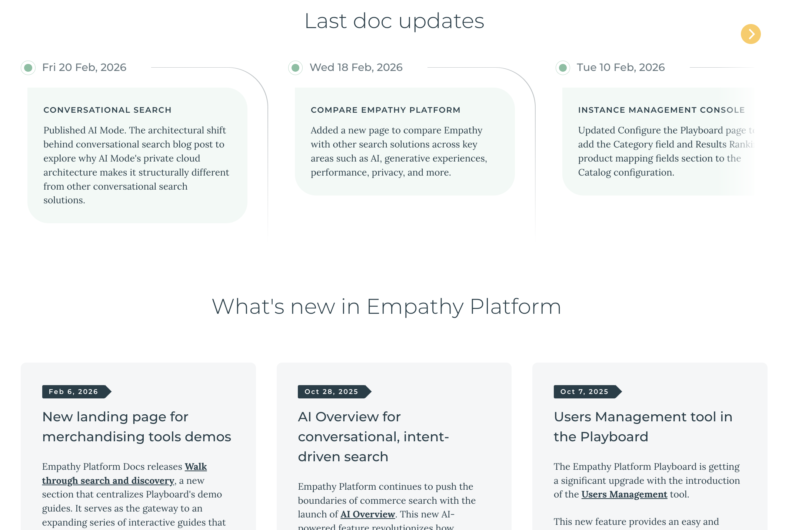
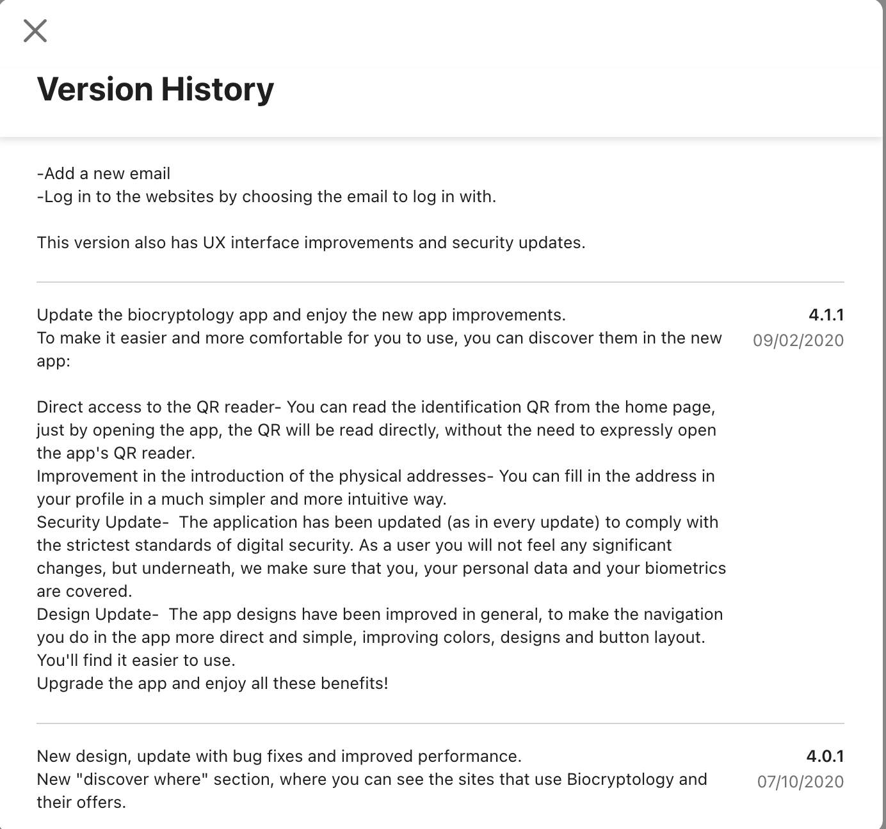
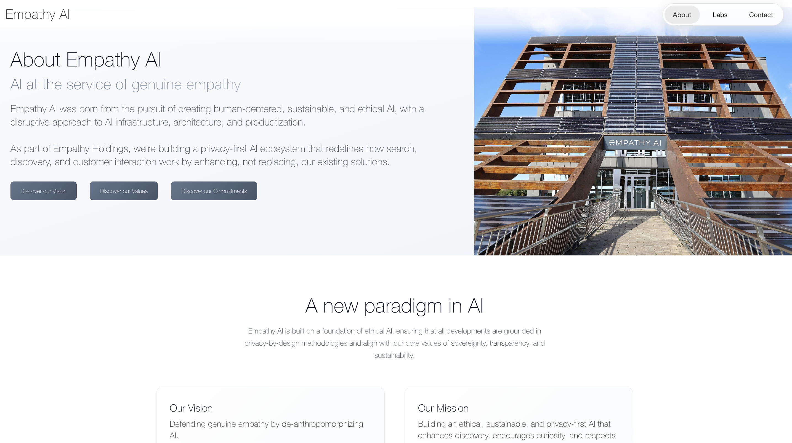
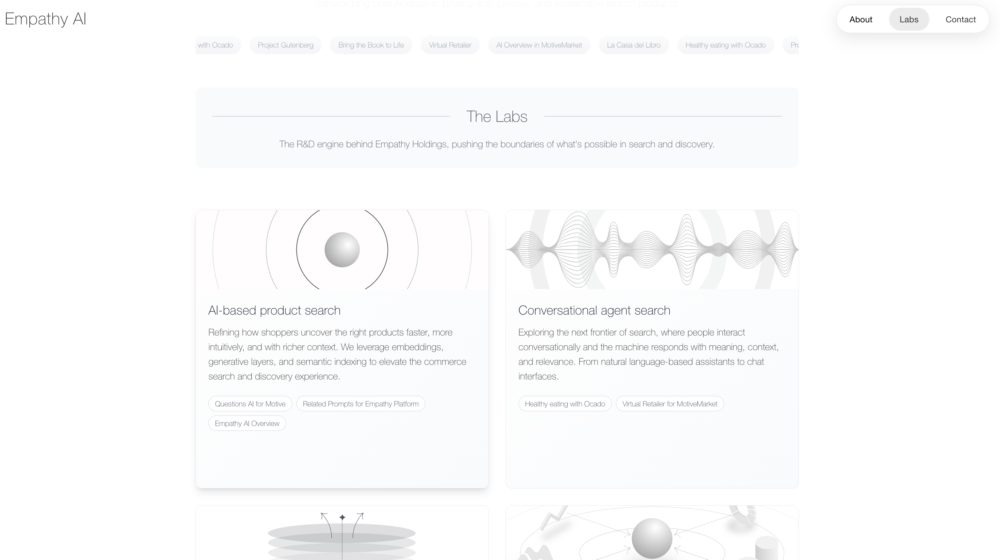
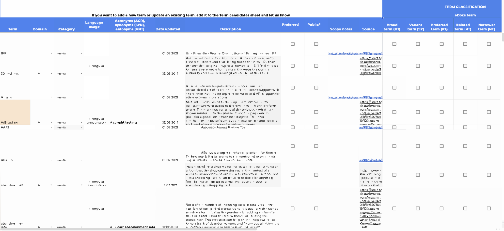
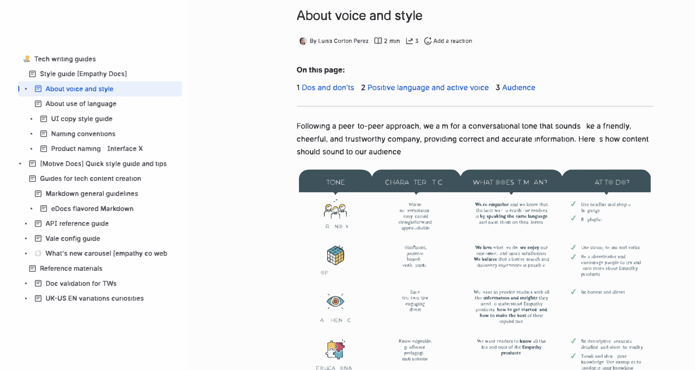
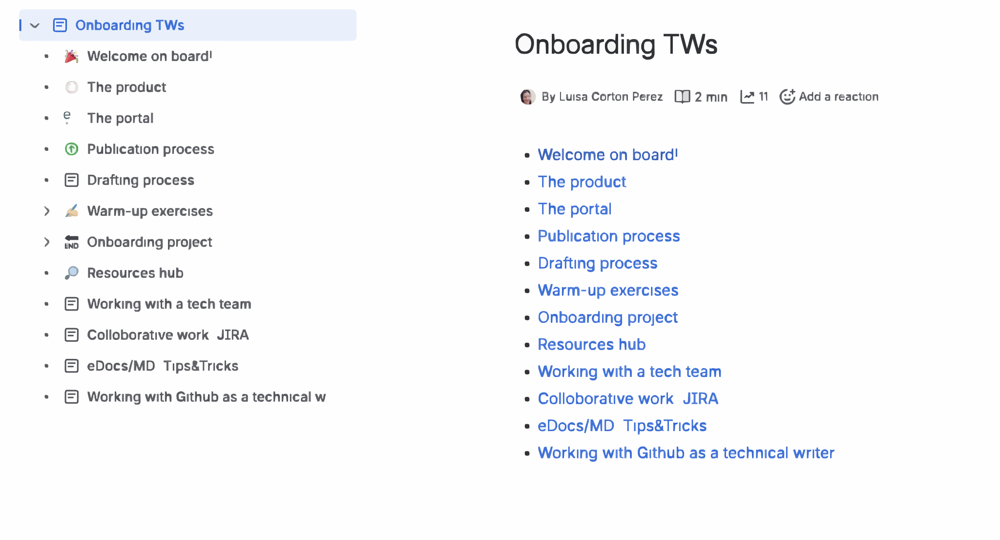
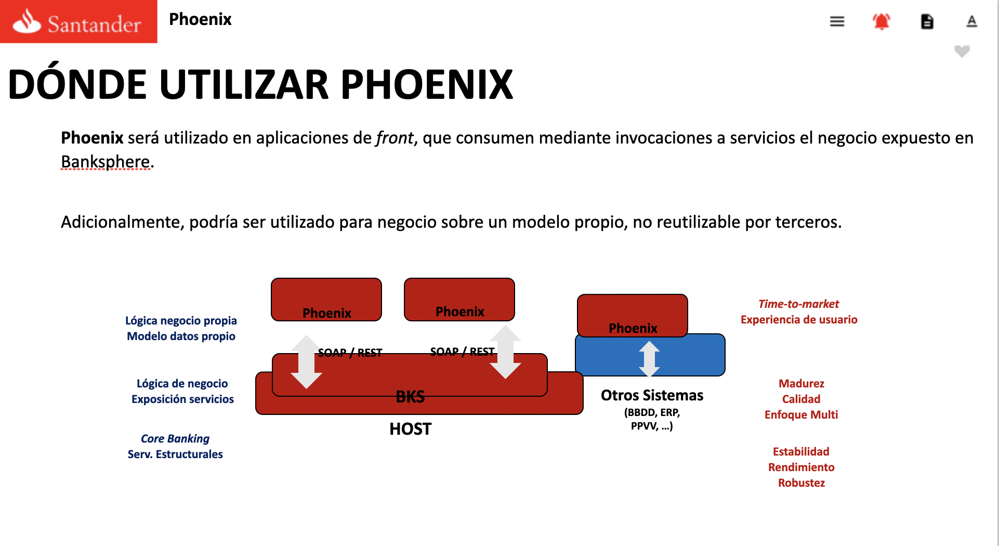

[Doc Sites & Portals](#doc-sites--portals) · [Overviews](#conceptual-docs-functional-overviews--reference-manuals) · [Tutorials](#tutorials--how-to-guides) · [Integration Guides](#integration--developer-guides) · [Configuration Guides](#configuration-guides) · [API & UI Reference](#api--ui-reference) · [Architecture Docs](#architecture-docs) · [Release Notes](#release-notes) · [Blog Posts](#blog-posts) · [Open-source Collabs](#open-source-collabs) · [Web Content](#web-content) · [Internal Materials](#internal-materials)

---

## Doc Sites & Portals

- <a href="https://docs.empathy.co">Empathy Platform Docs</a> — Empathy Platform
- <a href="https://docs.motive.co/">Motive Docs</a> — Motive
- Publicaciones - Isban (Not publicly accessible) — Vector ITC & Banco Santander

For full project background and context, see [Selected Work Examples](work-examples.md).

---

## Conceptual Docs, Functional Overviews & Reference Manuals

- <a href="https://docs.empathy.co/understand-empathy-platform/search-features/related-tags-overview.html">Related Tags Overview</a> — Empathy Platform
- <a href="https://docs.empathy.co/understand-empathy-platform/about-empathy-platform/understand-semantics-in-ai-search/">Understand Semantics and Vectors</a> — Empathy Platform
- <a href="https://docs.empathy.co/understand-empathy-platform/about-empathy-platform/understand-semantics-in-ai-search/why-semantics-in-ai-search.html">Why Semantic Search</a> — Empathy Platform
- <a href="https://docs.empathy.co/understand-empathy-platform/about-empathy-platform/approach-search-relevance/">Search Relevance</a> — Empathy Platform
- <a href="https://docs.empathy.co/play-with-empathy-platform/discover-playboard/">Discover the Playboard</a> — Empathy Platform
- <a href="assets/dp-user-manual-excerpt.pdf" target="_blank">Working Area - PDF excerpt</a> (censored excerpts available upon request) — DocPath 
- Publicaciones - Isban (Not publicly accessible - DITA snippet below) — Vector ITC & Banco Santander 
  
<details>
<summary><strong>Product Functional Guide - DITA snippet</strong></summary>

 <div markdown="1">

```xml
<?xml version="1.0" encoding="utf-8"?>
<!DOCTYPE topic PUBLIC "-//OASIS//DTD DITA Topic//EN" "../../dtd/technicalContent/dtd/topic.dtd">
<topic id="[DOC-ID]" xml:lang="en-gb">
  <title>Automatic Waiver (Batch Process)</title>
  <titlealts>
    <navtitle>BP-Automatic Waiver</navtitle>
    <searchtitle>Automatic Waiver - [MODULE]</searchtitle>
  </titlealts>
  <shortdesc>[MODULE] executes a series of processes before the prenotifications of debits,
  where the analysis of the debits to be waived is performed based on predefined conditions.</shortdesc>
  <prolog>
    <metadata>
      <keywords>
        <indexterm>[MODULE]</indexterm>
        <indexterm>Automatic Waiver</indexterm>
        <indexterm>Batch Process</indexterm>
      </keywords>
    </metadata>
  </prolog>
  <body>
    <p>When [MODULE] decides to reduce an item, it uses the waiver service defined in the
    Attributes Model of the calling application and reflected in the CATALOGUE,
    in the corresponding products and services.</p>
    <p>The banking transaction is defined so that it is reported to [Reporting System].</p>
    <p>Interest and items sent by SETTLEMENTS may not be waived, given that this is done
    by the aforementioned application. However, in the special case of overdraft items,
    [MODULE] verifies in advance whether automatic waiver should proceed.</p>
    <p>Configuration of the predefined conditions that determine the automatic waiver
    of items is established in a flat file in the following manner:</p>
    <ul>
      <li>Company/Product/Sub-type/Reference standard.</li>
      <li>Group: annual, performed entries, returned entries, semi-annual.</li>
      <li>Maximum number of debits to reduce or charge.</li>
      <li>Fixed amount.</li>
      <li>Amount (From/To).</li>
      <li>Items related to the exception.</li>
    </ul>
  </body>
  <related-links>
    <linklist>
      <title>Related functionalities:</title>
      <link format="dita" href="[internal-path]" scope="local" type="topic"/>
      <link format="dita" href="[internal-path]" scope="local" type="topic"/>
    </linklist>
  </related-links>
</topic>
```

</div>
</details>

---

## Tutorials & How-to Guides

- <a href="https://docs.empathy.co/play-with-empathy-platform/fine-tune-search-and-discovery/configure-next-queries.html">Configure Next Queries</a> — Empathy Platform (co-authored)
- <a href="https://docs.empathy.co/play-with-empathy-platform/analyze-search-and-discovery/use-terms.html">Visualize search terms</a> — Empathy Platform (co-authored)

---

## Integration & Developer Guides

- <a href="https://docs.empathy.co/develop-empathy-platform/build-search-ui/web-archetype-integration-guide.html">Integrate Interface X Archetype into an existing website</a> — Empathy Platform
- <a href="https://docs.empathy.co/develop-empathy-platform/build-search-ui/web-x-components-injection-guide.html">Inject Interface X Components into your website's DOM</a> — Empathy Platform
- <a href="https://docs.empathy.co/develop-empathy-platform/index-product-feed/index-feed-with-api/">Index a Feed using the Index API</a> — Empathy Platform
- <a href="https://docs.empathy.co/develop-empathy-platform/capture-interaction-signals/tagging-api-guide.html">Integrate Tagging using the Tagging API</a> — Empathy Platform
- Publicaciones - Isban (Not publicly accessible - DITA snippet below) — Vector ITC & Banco Santander

<details>
<summary><strong>Programming Guide - DITA snippet</strong></summary>

 <div markdown="1">

```xml
<?xml version="1.0" encoding="utf-8"?>
<!DOCTYPE reference PUBLIC "-//OASIS//DTD DITA EH Reference//EN" "reference.dtd">
<reference id="[DOC-ID]" xml:lang="en-gb">
  <title>[PROGRAM-ID]</title>
  <titlealts>
    <navtitle>[PROGRAM-ID]</navtitle>
    <searchtitle>[PROGRAM-ID] - [MODULE]</searchtitle>
  </titlealts>
  <shortdesc>MIXED ROUTINE FOR THE RECEPTION OF FEES</shortdesc>
  <prolog>
    <metadata>
      <keywords>
        <indexterm>[MODULE]</indexterm>
        <indexterm>[PROGRAM-ID]</indexterm>
      </keywords>
    </metadata>
  </prolog>
  <refbody>
    <section>
      <table>
        <title>Versioning data</title>
        <tgroup cols="5">
          <thead>
            <row>
              <entry align="center">Application</entry>
              <entry align="center">Subapplication</entry>
              <entry align="center">Version/Release</entry>
              <entry align="center">System</entry>
              <entry align="center">Area</entry>
            </row>
          </thead>
          <tbody>
            <row>
              <entry align="left">[APP-ID]</entry>
              <entry align="left">[SUBAPP-ID]</entry>
              <entry align="left">0020/0000</entry>
              <entry align="left">[SYS-ID]</entry>
              <entry align="left">[AREA-ID]</entry>
            </row>
          </tbody>
        </tgroup>
      </table>
    </section>
    <section>
      <title>Call flow</title>
      <dl>
        <dlentry>
          <dt>Programs called by</dt>
          <dd>
            <ul>
              <li>[PROGRAM-ID] - MIXED ROUTINE FOR BD UPDATE</li>
              <li>[PROGRAM-ID] - MIXED ROUTINE FOR FEE PRENOTIFICATION</li>
              <li>[PROGRAM-ID] - SERVICES DISTRIBUTOR</li>
              <li>[PROGRAM-ID] - BRANCH TABLE ENQUIRY ROUTINE</li>
              <li>[PROGRAM-ID] - CURRENCY TABLE ENQUIRY ROUTINE</li>
            </ul>
          </dd>
        </dlentry>
        <dlentry>
          <dt>Tables accessed</dt>
          <dd>
            <ul>
              <li>[TABLE-ID]
                <ul><li>Type of access: SELECT INSERT</li></ul>
              </li>
              <li>[TABLE-ID]
                <ul><li>Type of access: INSERT</li></ul>
              </li>
              <li>[TABLE-ID]
                <ul><li>Type of access: SELECT</li></ul>
              </li>
            </ul>
          </dd>
        </dlentry>
      </dl>
    </section>
    <section>
      <title>Error codes</title>
      <dl>
        <dlentry>
          <dt>Error codes</dt>
          <dd>
            <ul>
              <li>XX1111 - TECHNICAL ERROR. PLEASE CONTACT YOUR [SUPPORT CONTACT]</li>
              <li>XX3333 - TECHNICAL ERROR. PLEASE CONTACT YOUR [SUPPORT CONTACT]</li>
              <li>XX9520 - YOUR REQUEST CANNOT BE ATTENDED AT THIS MOMENT. PLEASE TRY AGAIN LATER</li>
            </ul>
          </dd>
        </dlentry>
      </dl>
    </section>
  </refbody>
  <related-links>
    <linklist>
      <title>Related programs:</title>
      <link format="dita" href="[internal-path]" scope="local" type="reference"/>
      <link format="dita" href="[internal-path]" scope="local" type="reference"/>
    </linklist>
  </related-links>
</reference>
```

</div>
</details>
---

## Configuration Guides

- <a href="https://docs.empathy.co/play-with-empathy-platform/configure-empathy-platform/configure-search-service/">Configure the Search Service</a> — Empathy Platform
- <a href="https://docs.empathy.co/play-with-empathy-platform/configure-empathy-platform/configure-search-service/search-relevancy-tuning.html">Relevancy Tuning Features</a> — Empathy Platform
- <a href="assets/dp-config-guide-excerpt.pdf" target="_blank">Configure the INI File - PDF excerpt</a> (censored excerpts available upon request) — DocPath 

---

## API & UI Reference

- Sample search endpoint doc based on a search API legacy version:
  - <a href="/docs/example-search-api-doc.yaml" download> Download YAML file</a>.
  - <a href="https://editor.swagger.io/?url=https://mlcorton.github.io/portfolio/docs/example_search_api_doc.yaml" target="_blank">See interactive doc version - Swagger</a>
  - <a href="https://redocly.github.io/redoc/?url=https://mlcorton.github.io/portfolio/docs/example_search_api_doc.yaml" target="_blank">See interactive doc version - Redocly</a>

- <a href="https://docs.empathy.co/develop-empathy-platform/api-reference/">API Reference</a> — Empathy Platform
- <a href="https://docs.empathy.co/develop-empathy-platform/ui-reference/">UI Reference</a> — Empathy Platform (Vue.js components)
  - <a href="https://docs.empathy.co/develop-empathy-platform/ui-reference/components/search-box/x-components.search-input.html">Search Input component</a> — Empathy Platform (Vue.js components)
  - <a href="https://docs.empathy.co/develop-empathy-platform/ui-reference/components/next-queries/x-components.next-queries.html">Next Queries component</a> — Empathy Platform (Vue.js components)
  
---

## Architecture Docs

- <a href="https://docs.empathy.co/develop-empathy-platform/build-search-ui/web-x-architecture.html">How Interface X works</a> — Empathy Platform
- <a href="https://docs.empathy.co/develop-empathy-platform/index-product-feed/feed-indexing-process.html">Catalog Index Process</a> — Empathy Platform
- <a href="https://docs.empathy.co/understand-empathy-platform/diagram/microservices/">Microservices Layer</a> — Empathy Platform

---

## Release Notes

- <a href="https://docs.empathy.co/whats-new.html#release-notes-2025">Release Notes 2025</a> — Empathy Platform
- <a href="https://docs.empathy.co/release-notes-2022.html">Seasonal Release Notes</a> — Empathy Platform
- <a href="https://docs.empathy.co/doc-updates.html">Doc Releases</a> — Empathy Platform
- <a href="https://apps.apple.com/us/app/b-fy-app/id1334660999">Doc Releases</a> — Biocryptology App (Discontinued)

| | |
|---|---|
|  |  |

---

## Blog Posts

- <a href="https://medium.com/empathyco/redefining-technical-documentation-at-empathy-co-a-three-year-journey-of-disruption-6457b617c386">Redefining Technical Documentation at Empathy.co: A Three-Year Journey of Disruption</a>
- <a href="https://docs.empathy.co/blog/welcome-ai-mode.html">Welcome, AI Mode</a>
- <a href="https://docs.empathy.co/blog/interface-x-integration-paths.html">Integrating Interface X Your Way</a>
- <a href="https://docs.empathy.co/blog/fine-tune-mistral-for-dev-portal-overview.html">Fine-tuning Mistral for an Enhanced Content Search Experience (Parts I–IV)</a>
- <a href="https://docs.empathy.co/blog/revolutionize-search-analytics-with-backroom.html">Revolutionize Your Commerce Search Analytics with Empathy's Backroom</a>

---

## Open-source Collabs

- <a href="https://github.com/empathyco/x">Interface X Components</a>  — Empathy Platform
- <a href="https://github.com/empathyco/empathy-self-managed-components">Self-Managed Components</a>  — Empathy Platform

---

## Web Content

- Extended and created new web pages and landing pages for <a href="https://empathy.ai">empathy.ai</a> using AI-assisted tools such as Lovable AI and Cursor. — Code snippets available upon request (version discontinued)

| | |
|---|---|
|  |  |

---

## Internal Materials

Non-public materials available as censored excerpts upon request.

- Style Guides & Writing Standards
- Product & Domain Glossaries
- Technical Writer Onboarding Guides
- Partner & Stakeholder Training Materials
- Documentation Processes & Workflows

| | |
|---|---|
|  |  |
|  |  |


[← Home](index.md) · [Work Examples →](work-examples.md)