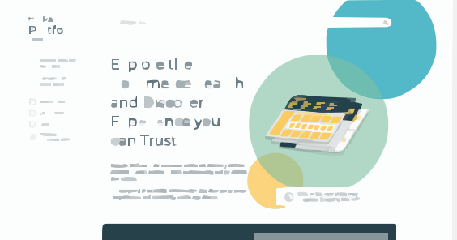
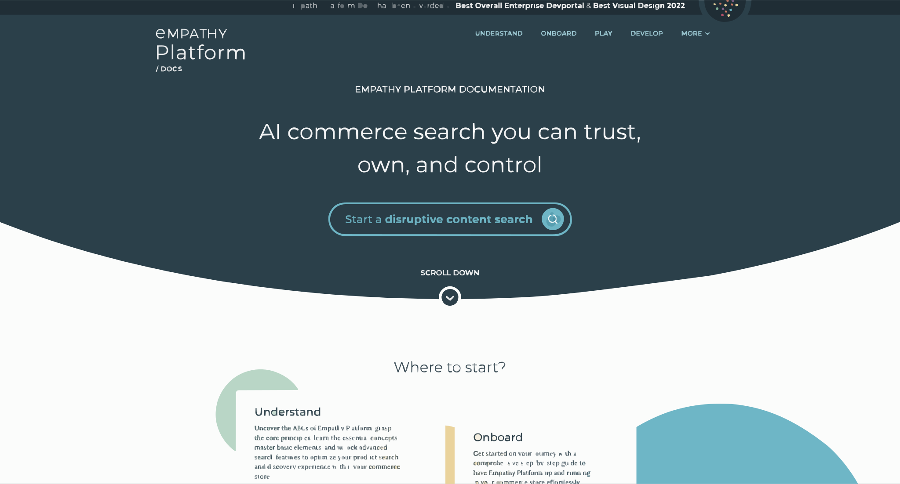
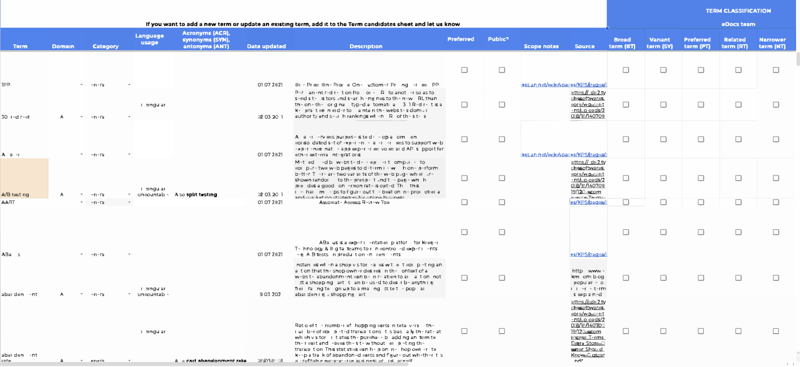
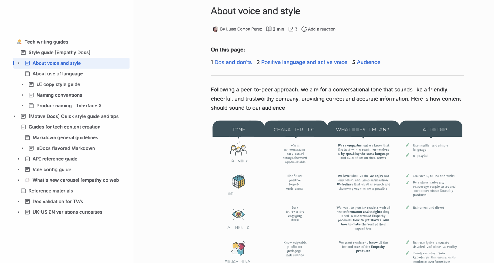
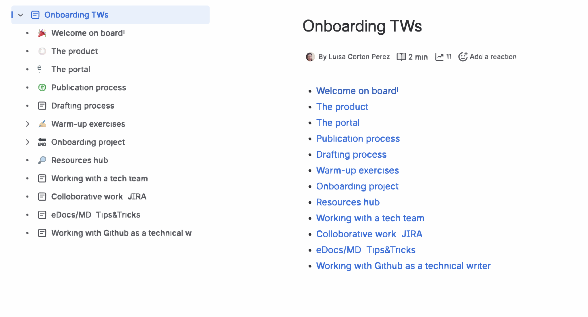
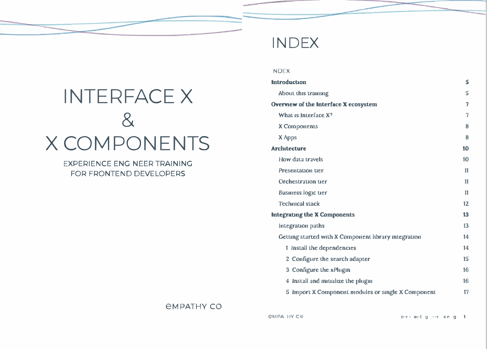

[Empathy Platform Docs](#empathy-platform-documentation) · [Motive Docs](#motive-documentation) · [Apisearch Docs](#apisearch-documentation) · [Other Docs](#other-docs)

# Empathy Platform Documentation 

- [**Related Tags Overview**](https://docs.empathy.co/understand-empathy-platform/search-features/related-tags-overview.html)  
  Functional overview aimed at a general audience, explaining one of the platform’s most advanced search features.  

- [**Boost and Bury Products with Query Ranking**](https://docs.empathy.co/play-with-empathy-platform/fine-tune-search-and-discovery/use-query-ranking/)   
  How-to guide for product search managers and merchants, focused on configuring product ranking based on business and customer needs.  

- [**Integrate Interface X Archetype into an Existing Website**](https://docs.empathy.co/develop-empathy-platform/build-search-ui/web-archetype-integration-guide.html)    
  Step-by-step integration guide for developers and integration engineers, covering installation and configuration of the search UI layer using predefined web components. 

- [**Relevancy Tuning Features**](https://docs.empathy.co/play-with-empathy-platform/configure-empathy-platform/configure-search-service/search-relevancy-tuning.html)  
  Configuration reference for integrators and partners, detailing available setup options when integrating the product.

 - [**UI Reference**](https://docs.empathy.co/develop-empathy-platform/ui-reference/)      
  Comprehensive reference documentation describing the UI components, configuration options, and usage patterns available when building search interfaces using Vue.js.  
  
- [**API Reference**](https://docs.empathy.co/develop-empathy-platform/api-reference/)   
  Reference documentation covering the platform’s APIs, endpoints, and parameters for developers and integration partners.  

  
<strong>Project Background</strong>

   

  
Empathy.co needed a new, scalable documentation portal to replace a hard-to-maintain CMS with outdated, limited content. <a href="https://empathy.co/docs/">Existing documentation</a> did not meet customer expectations: it was heavily technical, fragmented, and focused on an earlier version of the product.

  
  
<strong>My Role & Impact</strong>

    <ul>
      <li>Co-defined the documentation portal design and development</li>
      <li>Led the <strong>information architecture</strong> and content model</li>
      <li>Defined and maintain <strong>style guides, content standards, glossaries and documentation guidelines</strong> to ensure a consistent voice and tone across the product</li>
      <li>Aligned documentation language and tone with <strong>brand principles</strong>, while adapting content to different audiences and use cases</li>
      <li>Authored approximately <strong>75% of the documentation</strong></li>
      <li>Established a documentation system covering multiple content types:
        <ul>
          <li>Conceptual and feature overviews. See <a href="https://docs.empathy.co/understand-empathy-platform/">Understand Empathy Platform</a></li>
          <li>Onboarding and integration guides. See <a href="https://docs.empathy.co/onboard-empathy-platform/">Onboard Empathy Platform</a></li>
          <li>How-to and demo guides. See <a href="https://docs.empathy.co/play-with-empathy-platform/">Play with Empathy Platform</a></li>
          <li>API and UI reference documentation and development guidelines for technical audiences. See <a href="https://docs.empathy.co/develop-empathy-platform/">Develop Empathy Platform</a></li>
        </ul>
      </li>
      <li>Authored and maintained additional <strong>product communication materials</strong>, including: content update timelines, content release notes and product changelogs, product roadmap–related documentation, and blog posts and FAQs.</li>
      <li>Collaborated on documentation for <strong>internal open-source projects</strong>, working closely with engineering teams to ensure clarity, accuracy, and maintainability</li>
    </ul>
  
The result was a <strong>docs-as-code-based, centralized, scalable <a href="https://docs.empathy.co">documentation portal</a></strong> aligned with the product’s evolution and the needs of different user profiles, from non-technical users to developers, integrators, and partners.

<table>
  <tr>
    <td align="center">
       
      Legacy CMS
    </td>
    <td align="center">
       
      Transition phase v1
    </td>
    <td align="center">
       
      Transition phase v2
    </td>
    <td align="center">
       
      Current portal
    </td>
  </tr>
</table>

---

# Motive Documentation 

- [**Motive Docs**](https://docs.motive.co/)

  
<strong>Project Background</strong>

   

Motive’s documentation was initially owned by a different team and published in <strong>Confluence</strong>, making it significantly hard for customers to discover and access documentation. The structure and tooling were not aligned with how users searched for help or learned about the product.

<strong>My Role & Impact</strong>

When the project was transferred to my team, I led the migration of the documentation to our dedicated web-based documentation project, rethinking both structure and delivery:

  <ul>
    <li> Led the migration from Confluence to a centralized documentation website</li>
      <ul>
        <li> Reused and adapted the documentation infrastructure and UI components created for Empathy Platform Docs</li>
        <li> Defined and prioritized portal features aligned with non-technical user characteristics</li>
      </ul>  
    <li>Oversaw the existing content conversion into Markdown, enabling a docs-as-code approach</li>
    <li>Defined the information architecture based on user needs, profiles, and usage patterns</li>
    <li>Collaborated with stakeholders to review, refine, and validate content for clarity and usability</li>
  </ul>

The result was a documentation portal that was easier to discover, simpler to navigate, and better aligned with the expectations of non-technical SME customers. This project demonstrated how adapting documentation structure and tooling to the audience can significantly improve documentation discoverability and usability.

---

# Apisearch Documentation 

Due to the internal nature of this documentation, full guides are not publicly available. However, **censored excerpts and selected snippets** can be **shown upon request**, focusing on structure, clarity, and instructional approach rather than proprietary details.

  
<strong>Project Background</strong>

   

After the acquisition of Apisearch, the product had no existing documentation, neither internal nor public. In addition, the configuration dashboard's user experience was not self-explanatory enough to replace written documentation, creating friction for integrators during setup and configuration. There was an immediate need to provide guidance to internal teams while a more comprehensive documentation strategy could be defined.

<strong>My Role & Impact</strong>

As a quick solution, I led the definition and creation of integration and configuration quick guides, focusing on enabling fast product setup:

  <ul>
    <li>Defined the scope and structure of integration and configuration quick guides</li>
    <li>Oversaw and contributed to the authoring of documentation from scratch (initially written in Spanish)</li>
    <li>Published the documentation in Confluence as internal support documentation</li>
    <li>Reworked and adapted selected guides for an external audience</li>
  </ul>
  
This approach provided immediate value to internal teams, reduced setup friction, and established a documentation baseline that could later evolve into a more complete public documentation offering.

  

---

# Other Docs  

- **Blog Posts**:
  - [Integrating Interface X your way](https://docs.empathy.co/blog/interface-x-integration-paths.html)
  - [Redefining Technical Documentation at Empathy.co: A Three-Year Journey of Disruption](https://medium.com/empathyco/redefining-technical-documentation-at-empathy-co-a-three-year-journey-of-disruption-6457b617c386)
  - [Fine-tuning Mistral for an enhanced content search experience (parts I - IV)](https://docs.empathy.co/blog/fine-tune-mistral-for-dev-portal-overview.html)
  - [Revolutionize your commerce search analytics with Empathy’s Backroom](https://docs.empathy.co/blog/revolutionize-search-analytics-with-backroom.html)

- **Release Notes**:
  - [Release Notes 2025](https://docs.empathy.co/whats-new.html#release-notes-2025)
  - [Seasonal Release Notes](https://docs.empathy.co/release-notes-2024.html)
  - [Doc Releases](https://docs.empathy.co/doc-updates.html)
   
- **Open-source Content Collabs**:
  - [Interface X Components](https://github.com/empathyco/x)
  - [Self-Managed Components](https://github.com/empathyco/empathy-self-managed-components)
   
- **Other Materials**: In addition to public-facing documentation, I’ve authored and maintained a range of **internal documentation and enablement materials** designed to support teams, partners, and contributors, including:
  - Training materials for partners and internal stakeholders
  - Product and domain glossaries
  - Documentation style guides and writing standards
  - Technical writer training and onboarding guides
  - Internal documentation processes and workflows  

  These materials were created as internal, non-public resources and were distributed in printed or restricted-access formats. Only selected and censored excerpts could be shown upon request.

<table>
  <tr>
    <td align="center">
       
      Glossaries & Dictionaries
    </td>
    <td align="center">
       
      Style Guides
    </td>
    <td align="center">
       
      Onboarding and Training Guides for Technical Writers
    </td>
    <td align="center">
       
      Learning Paths & Certifications
    </td>
  </tr>
</table>

