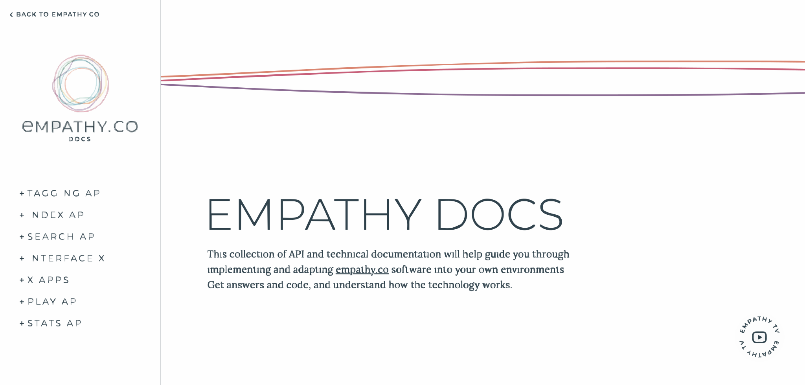
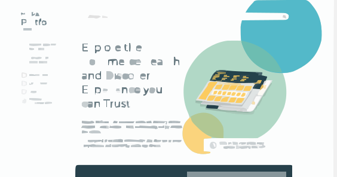
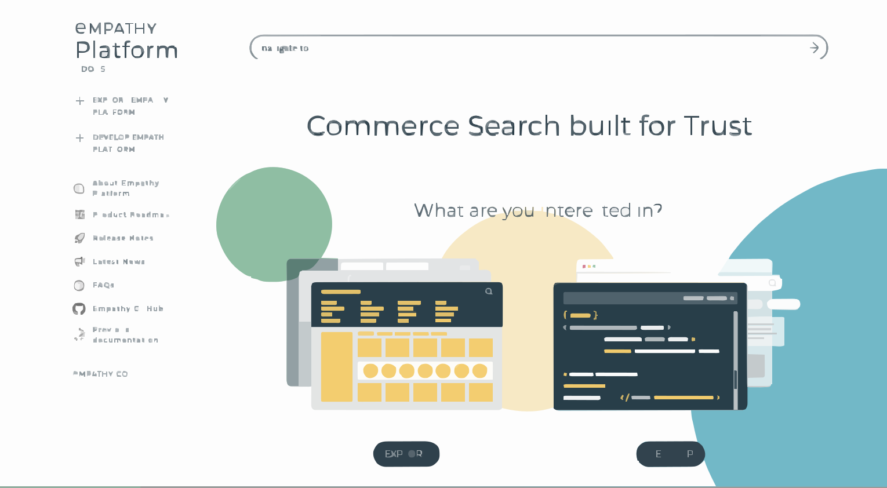
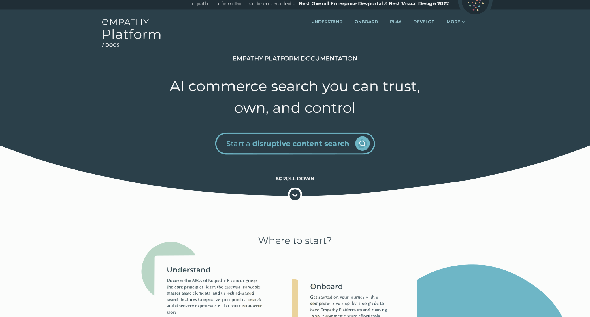
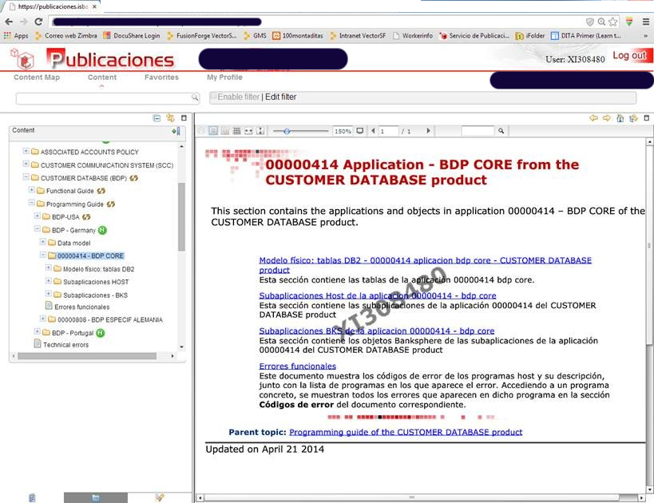
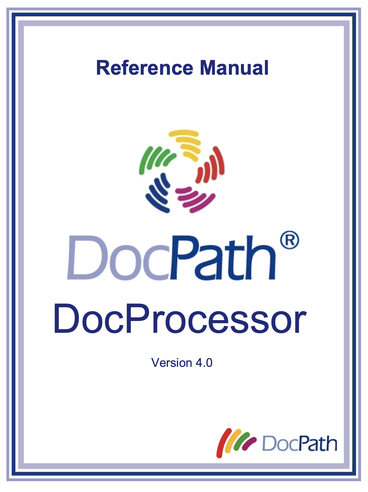

[Empathy Platform Docs](#empathy-platform-documentation) · [Motive Docs](#motive-documentation) · [Apisearch Docs](#apisearch-documentation) · [Publicaciones](#publicaciones--isban-documentation) · [DocPath Docs](#docpath-documentation)

# Empathy Platform Documentation

Empathy.co needed a scalable documentation portal to replace a hard-to-maintain CMS with outdated, fragmented content that did not meet customer expectations. I led the project from architecture to execution, building a centralized docs-as-code portal covering multiple content types and audiences — from non-technical users to developers and integration partners.

**Highlights:** Led information architecture and content model · Authored ~75% of the documentation · Defined style guides, content standards, and glossaries · Established a documentation system covering multiple content types and audiences

- <a href="https://docs.empathy.co/understand-empathy-platform/search-features/related-tags-overview.html">Related Tags Overview</a>  
  Functional overview aimed at a general audience, explaining one of the platform's most advanced search features.    

- <a href="https://docs.empathy.co/play-with-empathy-platform/fine-tune-search-and-discovery/configure-next-queries.html">Configure Next Queries</a>   
  How-to guide for product search managers and merchants, focused on configuring next product recommendations based on business and customer needs.  

- <a href="https://docs.empathy.co/develop-empathy-platform/build-search-ui/web-archetype-integration-guide.html">Integrate Interface X Archetype into an Existing Website</a>     
  Step-by-step integration guide for developers and integration engineers, covering installation and configuration of the search UI layer using predefined web components. 

- <a href="https://docs.empathy.co/play-with-empathy-platform/configure-empathy-platform/configure-search-service/search-relevancy-tuning.html">Relevancy Tuning Features</a>    
  Configuration reference for integrators and partners, detailing available setup options when integrating the product.

- <a href="https://docs.empathy.co/develop-empathy-platform/ui-reference/">UI Reference</a>         
  Comprehensive reference documentation describing the UI components, configuration options, and usage patterns available when building search interfaces using Vue.js.  
  
- <a href="https://docs.empathy.co/develop-empathy-platform/api-reference/">API Reference</a>  
  Reference documentation covering the platform's APIs, endpoints, and parameters for developers and integration partners.  

  
<strong>Full Project Background</strong>

   

  
Empathy.co needed a new, scalable documentation portal to replace a hard-to-maintain CMS with outdated, limited content. <a href="https://empathy.co/docs/">Existing documentation</a> did not meet customer expectations: it was heavily technical, fragmented, and focused on an earlier version of the product.

  
  
<strong>My Role & Impact</strong>

    <ul>
      <li>Co-defined the documentation portal design and development</li>
      <li>Led the <strong>information architecture</strong> and content model</li>
      <li>Defined and maintain <strong>style guides, content standards, glossaries and documentation guidelines</strong> to ensure a consistent voice and tone across the product</li>
      <li>Aligned documentation language and tone with <strong>brand principles</strong>, while adapting content to different audiences and use cases</li>
      <li>Authored approximately <strong>75% of the documentation</strong></li>
      <li>Established a documentation system covering multiple content types:
        <ul>
          <li>Conceptual and feature overviews. See <a href="https://docs.empathy.co/understand-empathy-platform/">Understand Empathy Platform</a></li>
          <li>Onboarding and integration guides. See <a href="https://docs.empathy.co/onboard-empathy-platform/">Onboard Empathy Platform</a></li>
          <li>How-to and demo guides. See <a href="https://docs.empathy.co/play-with-empathy-platform/">Play with Empathy Platform</a></li>
          <li>API and UI reference documentation and development guidelines for technical audiences. See <a href="https://docs.empathy.co/develop-empathy-platform/">Develop Empathy Platform</a></li>
        </ul>
      </li>
      <li>Authored and maintained additional <strong>product communication materials</strong>, including: content update timelines, content release notes and product changelogs, product roadmap–related documentation, and blog posts and FAQs.</li>
      <li>Collaborated on documentation for <strong>internal open-source projects</strong>, working closely with engineering teams to ensure clarity, accuracy, and maintainability</li>
    </ul>
  
The result was a <strong>docs-as-code-based, centralized, scalable <a href="https://docs.empathy.co">documentation portal</a></strong> aligned with the product's evolution and the needs of different user profiles, from non-technical users to developers, integrators, and partners.

<table>
  <tr>
    <td align="center">
       
      Legacy CMS
    </td>
    <td align="center">
       
      Transition phase v1
    </td>
    <td align="center">
       
      Transition phase v2
    </td>
    <td align="center">
       
      Current portal
    </td>
  </tr>
</table>

---

# Motive Documentation

Motive is a plug-and-play search and discovery solution for small and medium e-commerces. When the project was transferred to my team, documentation lived in Confluence — misaligned with how non-technical SME customers look for help. I led the migration to a dedicated web-based portal built around their needs.

**Highlights:** Led migration from Confluence to a web-based documentation portal · Defined information architecture based on user needs and profiles · Oversaw content conversion to Markdown, enabling a docs-as-code approach

- <a href="https://docs.motive.co/">Motive Docs</a>

  
<strong>Full Project Background</strong>

   

Motive's documentation was initially owned by a different team and published in <strong>Confluence</strong>, making it significantly hard for customers to discover and access documentation. The structure and tooling were not aligned with how users searched for help or learned about the product.

<strong>My Role & Impact</strong>

When the project was transferred to my team, I led the migration of the documentation to our dedicated web-based documentation project, rethinking both structure and delivery:

  <ul>
    <li> Led the migration from Confluence to a centralized documentation website</li>
      <ul>
        <li> Reused and adapted the documentation infrastructure and UI components created for Empathy Platform Docs</li>
        <li> Defined and prioritized portal features aligned with non-technical user characteristics</li>
      </ul>  
    <li>Oversaw the existing content conversion into Markdown, enabling a docs-as-code approach</li>
    <li>Defined the information architecture based on user needs, profiles, and usage patterns</li>
    <li>Collaborated with stakeholders to review, refine, and validate content for clarity and usability</li>
  </ul>

The result was a documentation portal that was easier to discover, simpler to navigate, and better aligned with the expectations of non-technical SME customers. This project demonstrated how adapting documentation structure and tooling to the audience can significantly improve documentation discoverability and usability.

---

# Apisearch Documentation

Apisearch is a search solution sitting between Motive and Empathy Platform in terms of complexity and target audience. The challenge here was starting from zero. No internal or public documentation existed after the product was acquired. I led the creation of quick guides from scratch to unblock internal teams and integrators immediately.

**Highlights:** Defined the scope and structure of integration and configuration quick guides · Oversaw and contributed to authoring documentation from scratch · Reworked and adapted selected guides for an external audience

Due to the internal nature of this documentation, full guides are not publicly available. However, **censored excerpts and selected snippets** can be **shown upon request**, focusing on structure, clarity, and instructional approach rather than proprietary details.

  
<strong>Full Project Background</strong>

   

After the acquisition of Apisearch, the product had no existing documentation, neither internal nor public. In addition, the configuration dashboard's user experience was not self-explanatory enough to replace written documentation, creating friction for integrators during setup and configuration. There was an immediate need to provide guidance to internal teams while a more comprehensive documentation strategy could be defined.

<strong>My Role & Impact</strong>

As a quick solution, I led the definition and creation of integration and configuration quick guides, focusing on enabling fast product setup:

  <ul>
    <li>Defined the scope and structure of integration and configuration quick guides</li>
    <li>Oversaw and contributed to the authoring of documentation from scratch (initially written in Spanish)</li>
    <li>Published the documentation in Confluence as internal support documentation</li>
    <li>Reworked and adapted selected guides for an external audience</li>
  </ul>
  
This approach provided immediate value to internal teams, reduced setup friction, and established a documentation baseline that could later evolve into a more complete public documentation offering.

  

---

# Publicaciones — Isban Documentation

Publicaciones was the internal documentation portal for Isban, the software engineering branch of Banco Santander. The challenge was making developer documentation accessible across the entire group, originally in Spanish and translated into English. I led the project and the team, acting as direct client contact, while staying hands-on with editing and publication.

**Highlights:** Led documentation transformation into DITA format · Coordinated Spanish-to-English translation for group-wide accessibility · Managed publication into the Publicaciones portal · Handled multiple document types: functional product and application docs, and configuration and programming guides

Due to the internal nature of this project, documentation is not publicly accessible. Selected screenshots are shown below. Censored excerpts can be shown upon request.

---

# DocPath Documentation

DocPath Document Solutions is a software company specialized in Customer Communications Management and Contract Lifecycle Management, serving organizations in banking, insurance, logistics, and the public sector. Documentation here followed a traditional publishing approach, where user manuals, reference manuals, and configuration guides for multiple platforms were developed using desktop publishing tools and delivered in PDF format. I also developed in-app online help.

**Highlights:** Authored user and reference manuals and configuration guides for Windows, Linux, AIX, and AS400 platforms · Delivered documentation in PDF format using desktop publishing tools · Produced documentation primarily in English, with selected reference manuals in Spanish · Developed in-app online help

Due to the internal and traditional nature of this project, documentation is not available online. Selected screenshots are shown below. Censored excerpts and PDF snippets can be shown upon request.

---
[← Home](index.md) · [Document Types →](doc-types.md)
